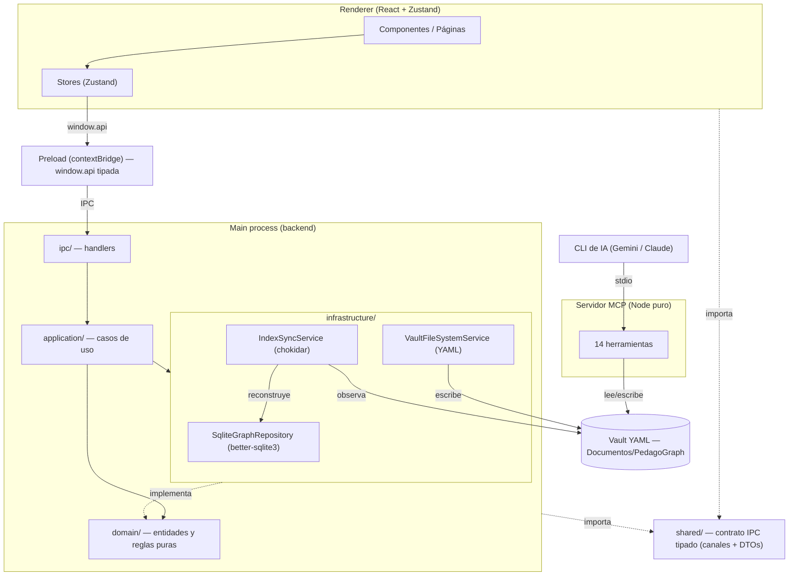
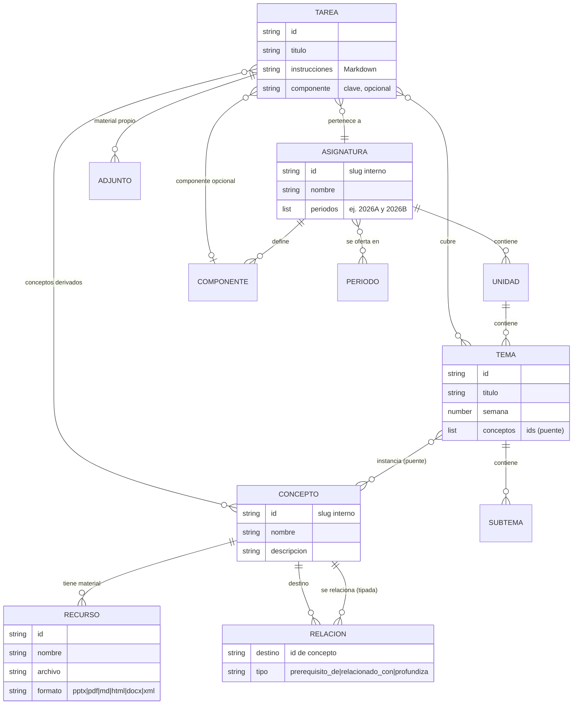
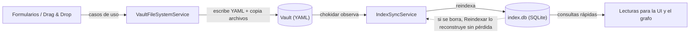
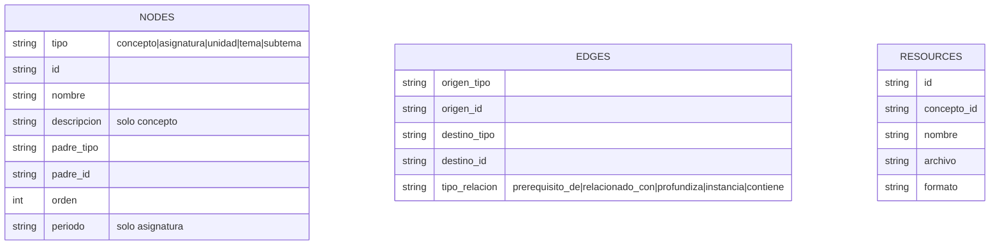
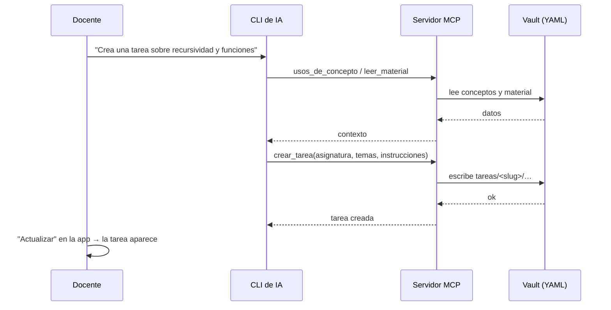

# PedagoGraph

> Organiza tu material pedagógico por **conceptos reutilizables** entre asignaturas y visualiza sus relaciones como un **grafo**.

**PedagoGraph** es una aplicación de escritorio (Electron) pensada para **docentes universitarios sin conocimientos técnicos**. Separa *lo que se enseña* (conceptos estables y transversales, con su material) de *dónde y cuándo se enseña* (asignaturas de un período), y conecta ambas capas. Planificar una asignatura nueva es, en gran parte, **reconectar** conceptos que ya existen — sin duplicar material.

- **Cero configuración**: al primer arranque crea su almacén de datos y funciona.
- **Sin jerga técnica**: todo es formularios, buscadores y arrastrar-y-soltar. El usuario nunca ve archivos, YAML ni rutas.
- **Copiloto de IA opcional**: conecta tu CLI de IA (Gemini/Antigravity o Claude Code) al grafo mediante MCP para leer material, crear tareas y sugerir conexiones.

Repositorio: https://github.com/paulosk8/HiDev-graphs

---

## Índice

1. [Características](#características)
2. [Stack tecnológico](#stack-tecnológico)
3. [Requisitos previos](#requisitos-previos)
4. [Instalación y ejecución](#instalación-y-ejecución)
5. [Scripts disponibles](#scripts-disponibles)
6. [Arquitectura](#arquitectura)
7. [Modelo de dominio](#modelo-de-dominio)
8. [Persistencia: vault + índice](#persistencia-vault--índice)
9. [El grafo de conocimiento](#el-grafo-de-conocimiento)
10. [Estructuras de datos clave](#estructuras-de-datos-clave)
11. [Copiloto de IA (MCP)](#copiloto-de-ia-mcp)
12. [Estructura del proyecto](#estructura-del-proyecto)
13. [Cómo extender el proyecto](#cómo-extender-el-proyecto)
14. [Hoja de ruta](#hoja-de-ruta)

---

## Características

### Capa de conocimiento (transversal, estable)
- **Conceptos** reutilizables (p. ej. "Recursividad", "Divide y vencerás") con CRUD por formularios.
- **Material** por concepto: se agrega **arrastrando archivos** (o con selector nativo). La app copia el archivo a su almacén y lo clasifica por extensión. Formatos: `pptx, pdf, md, html, docx, xml`.
- **Relaciones tipadas** entre conceptos: `prerequisito_de`, `relacionado_con`, `profundiza`.
- **Ficha de concepto**: muestra su material y **en qué asignaturas / unidades / temas se usa**.
- **Búsqueda** de conceptos por nombre, descripción y tema.

### Capa curricular
- **Asignaturas** con **wizard** paso a paso (unidades → temas → subtemas → semanas).
- Una asignatura se **oferta en uno o varios períodos** sin duplicar contenido (se muestra como *"Algoritmos · 2026A, 2026B"*).
- **Componentes de aprendizaje** configurables por asignatura (ej.: `CD` contacto docente, `CP` componente práctico, `APE` aprendizaje práctico experimental, `AA` aprendizaje autónomo).
- **Vínculo Tema ↔ Concepto** con autocompletado (y crear concepto nuevo en línea): es el puente que permite reutilizar el material entre asignaturas.
- Listado con **buscador y filtro por período**, y contador de **unidades · temas · tareas** en cada tarjeta.

### Tareas (capa transversal)
- **Tareas** ligadas a uno o varios temas, un componente opcional y los conceptos derivados de sus temas.
- Instrucciones en **Markdown** (previsualización + descarga `.md`), **adjuntos** y apertura en la app del sistema.
- **Duplicar** una tarea a otra asignatura (reutilización) y **combinar** varias tareas en una nueva heredando su material.
- **Cruces**: sugiere en qué otras asignaturas reutilizar una tarea según los conceptos que comparte.

### Mapa de conceptos (grafo)
- Visualización con **Cytoscape.js** + layout **fcose**.
- Nodos: **conceptos**, **asignaturas** y **tareas**; aristas: uso, co-ocurrencia, relaciones tipadas y tarea→concepto.
- Filtros por tipo de relación, panel lateral de conceptos, colores para los relacionados, tipografía que se ajusta al zoom.
- **Terminal embebida** para lanzar el CLI de IA junto al grafo, con generador de **prompts** de ejemplo.
- **Combinar tareas** seleccionando dos nodos-tarea que comparten un concepto.

### Copiloto de IA (MCP)
- Servidor **MCP** que expone el grafo como **14 herramientas** para un CLI de IA (consultar el grafo, leer material, crear/duplicar/combinar tareas, analizar y crear conexiones).
- **Auto-conexión** con un clic desde la pantalla *"Asistente IA"* (Gemini/Antigravity y Claude Code).
- Corre con el motor incluido en la app (no requiere Node instalado aparte).

### Otros
- **Modo oscuro** persistente.
- **Reindexar** el almacén y **copia de seguridad** (zip) del vault.
- Todo en **español** y sin términos técnicos en la interfaz.

---

## Stack tecnológico

| Área | Tecnología |
|------|-----------|
| Escritorio | **Electron** 41 + **electron-vite** 5 |
| UI | **React** 18 + **TypeScript** estricto + **Tailwind CSS** 3 |
| Estado (renderer) | **Zustand** 5 |
| Grafo | **Cytoscape.js** 3 + **cytoscape-fcose** |
| Índice | **better-sqlite3** 12 (solo en el proceso *main*) |
| Observación de archivos | **chokidar** 5 |
| YAML | **js-yaml** |
| Terminal | **@xterm/xterm** (renderer) + **node-pty** (main) |
| Extracción de texto | **unpdf** (PDF), **mammoth** (Word), **jszip** (PowerPoint), **marked** (Markdown) |
| Copiloto IA | **@modelcontextprotocol/sdk** + **zod** |
| Empaquetado/util | **archiver** (zip de respaldo) |

> Módulos **nativos**: `better-sqlite3` y `node-pty` se recompilan para el ABI de Electron mediante `@electron/rebuild` (script `postinstall`).

---

## Requisitos previos

- **Node.js 22** (ver `.nvmrc`). Con [nvm](https://github.com/nvm-sh/nvm): `nvm install && nvm use`.
- **npm** (incluido con Node).
- Herramientas de compilación de C/C++ para los módulos nativos:
  - **macOS**: Xcode Command Line Tools (`xcode-select --install`).
  - **Windows**: *Desktop development with C++* (Visual Studio Build Tools) + Python 3.
  - **Linux**: `build-essential` y `python3`.
- (Opcional) Un **CLI de IA** para el copiloto: [Gemini/Antigravity](https://antigravity.google/) o [Claude Code](https://docs.claude.com/en/docs/claude-code).

---

## Instalación y ejecución

```bash
# 1. Clonar
git clone https://github.com/paulosk8/HiDev-graphs.git
cd HiDev-graphs

# 2. Usar Node 22
nvm install && nvm use          # o instala Node 22 manualmente

# 3. Instalar dependencias
#    (el postinstall recompila better-sqlite3 y node-pty para Electron)
npm install

# 4. Arrancar en desarrollo
npm run dev
```

Al primer arranque, la app crea el almacén de datos en **`Documentos/PedagoGraph`** y ya puedes usarla.

### Datos de demostración (opcional)
```bash
npm run sembrar-demo    # crea conceptos y una asignatura de ejemplo (no destructivo)
```

### Servidor MCP (para el copiloto de IA)
```bash
npm run build:mcp       # compila out/mcp/pedagograph-mcp.mjs
```
Luego, en la app, ve a **"Asistente IA"** y pulsa **Conectar** junto a tu CLI. (Ver [Copiloto de IA](#copiloto-de-ia-mcp).)

### Compilación de producción
```bash
npm run build           # compila main + preload + renderer
npm run start           # previsualiza el build
```

### Solución de problemas
- **Errores al compilar módulos nativos**: verifica las herramientas de C/C++ del apartado anterior y vuelve a ejecutar `npm run rebuild`.
- **`EBADENGINE` / versión de Node**: asegúrate de estar en Node 22 (`node -v`).
- **Permisos de la caché de npm** (`EACCES`): `sudo chown -R $(id -u):$(id -g) ~/.npm`.
- **El servidor MCP no aparece en el CLI**: compila con `npm run build:mcp` y reinicia el CLI tras conectar.

---

## Scripts disponibles

| Script | Descripción |
|--------|-------------|
| `npm run dev` | Arranca la app en modo desarrollo (HMR). |
| `npm run build` | Compila la app (main + preload + renderer). |
| `npm run start` | Previsualiza el build de producción. |
| `npm run build:mcp` | Compila el servidor MCP a `out/mcp/pedagograph-mcp.mjs`. |
| `npm run sembrar-demo` | Siembra datos de ejemplo en el vault (no destructivo). |
| `npm run rebuild` | Recompila los módulos nativos para Electron. |
| `npm run typecheck` | Chequeo de tipos de `main`/`shared` y `renderer`. |

---

## Arquitectura

El **proceso principal (main) es un backend**: dominio puro, infraestructura (SQLite, sistema de archivos, chokidar) y casos de uso. El **renderer** solo llama IPC; no tiene lógica de negocio ni accede al disco. Un **contrato IPC tipado** en `src/shared` es la única superficie entre ambos.



**Reglas de arquitectura:**
- Las dependencias apuntan hacia el **dominio**: `application` depende de `domain`; `infrastructure` implementa interfaces de `domain`; `domain` no depende de nadie.
- Interfaces **solo donde hay variabilidad real** (p. ej. `IGraphRepository`). Sin abstracciones especulativas.
- El servidor MCP corre en **Node puro** (sin SQLite ni Electron): lee el vault en memoria y reutiliza los casos de uso que solo tocan el vault.

---

## Modelo de dominio

Dos capas conectadas por un puente **Tema ↔ Concepto**.



- **Concepto** → unidad de conocimiento reutilizable. Posee **Recursos** (el material) y **Relaciones** tipadas con otros conceptos. El material pertenece **al concepto, jamás a una asignatura**.
- **Asignatura → Unidad → Tema → Subtema** → jerarquía curricular. Se **oferta en varios períodos** sin duplicarse.
- **Tema instancia Conceptos** → puente que permite reutilizar material entre asignaturas.
- **Tarea** → capa transversal: cubre temas, deriva sus conceptos, tiene adjuntos e instrucciones.

Los nombres de dominio están en **español** para alinear el código con el lenguaje del usuario (`Concepto`, `Asignatura`, `Tema`, `Recurso`, `Relacion`, `Tarea`).

---

## Persistencia: vault + índice

La **fuente de verdad es el sistema de archivos** (un "vault" de YAML). El índice SQLite es **derivado y reconstruible**; la sincronización es **unidireccional**: `filesystem (YAML) → índice (SQLite)`, nunca al revés.



### Estructura del vault

```
Documentos/PedagoGraph/
├── conceptos/
│   └── <slug>/
│       ├── concepto.yaml        # metadatos + relaciones + lista de recursos
│       └── <archivos>           # material copiado (pdf, pptx, ...)
├── asignaturas/
│   └── <slug>/
│       └── pea.yaml             # unidades / temas / semanas / componentes / vínculos a conceptos
├── tareas/
│   └── <slug>/
│       ├── tarea.yaml           # temas, componente, conceptos, adjuntos
│       ├── instrucciones.md     # instrucciones en Markdown
│       └── <adjuntos>           # material propio de la tarea
└── .index/
    └── index.db                 # índice SQLite (derivado, reconstruible)
```

> El `slug` es un detalle interno (nombre de carpeta seguro); **nunca se muestra al usuario**.

---

## El grafo de conocimiento

El índice SQLite modela el grafo en **tres tablas**:



El **Mapa de conceptos** (Cytoscape) proyecta esto como nodos y aristas:

| Nodo | Origen |
|------|--------|
| `concepto` | conceptos del vault (tamaño = transversalidad) |
| `asignatura` | asignaturas del vault |
| `tarea` | tareas del vault (leídas fuera del índice) |

| Arista | Significado |
|--------|-------------|
| `usado_en` | concepto → asignatura (el puente que revela la reutilización) |
| `coocurre` | dos conceptos que se enseñan en el mismo tema |
| `prerequisito_de` / `relacionado_con` / `profundiza` | relaciones tipadas concepto → concepto |
| `tarea_concepto` | tarea → cada concepto que cubre |

---

## Estructuras de datos clave

### `concepto.yaml`
```yaml
id: recursividad
nombre: Recursividad
descripcion: Una función que se define en términos de sí misma.
recursos:
  - id: 7f3a…
    nombre: Apuntes de recursión
    archivo: apuntes-recursion.pdf
    formato: pdf
relaciones:
  - destino: divide-y-venceras
    tipo: relacionado_con
```

### `pea.yaml` (asignatura)
```yaml
id: algoritmos
nombre: Algoritmos
periodos: [2026A, 2026B]
componentes:
  - { clave: CD, nombre: Contacto docente }
  - { clave: AA, nombre: Aprendizaje autónomo }
unidades:
  - id: u1
    titulo: Fundamentos
    orden: 1
    temas:
      - id: t1
        titulo: Recursión
        orden: 1
        semana: 3
        conceptos: [recursividad, funciones]   # puente Tema ↔ Concepto
        subtemas: []
```

### `tarea.yaml`
```yaml
id: practica-de-recursion
titulo: Práctica de recursión
asignaturaId: algoritmos
temas: [t1]
componente: AA
conceptos: [recursividad, funciones]   # derivados de los temas
recursos: []                            # adjuntos de la tarea
```

### Contrato IPC (TypeScript, en `src/shared`)
```ts
// Envoltorio de resultado que cruza el puente IPC
type Resultado<T> =
  | { ok: true; valor: T }
  | { ok: false; error: { mensaje: string; sugerencia?: string } }

// Proyección de un concepto para listados/buscadores
interface ResumenConceptoDTO {
  id: string
  nombre: string
  descripcion: string
  totalRecursos: number
  temas: string[]        // títulos de los temas que lo usan
}
```

---

## Copiloto de IA (MCP)

El servidor MCP (`src/mcp/`) expone el grafo por **stdio** para que un CLI de IA lo consulte y modifique. Corre en **Node puro** (sin SQLite ni Electron) y lee el vault directamente; la ruta se toma de `PEDAGOGRAPH_VAULT`.

### Herramientas (14)

| Herramienta | Tipo | Qué hace |
|-------------|------|----------|
| `resumen_grafo` | lectura | Totales y conceptos más transversales. |
| `listar_asignaturas` | lectura | Asignaturas con períodos, componentes y nº de unidades/temas. |
| `detalle_asignatura` | lectura | Unidades → temas (con conceptos) de una asignatura. |
| `buscar_conceptos` | lectura | Busca conceptos por nombre; devuelve materiales y transversalidad. |
| `usos_de_concepto` | lectura | Dónde se usa un concepto (asignatura › unidad › tema). |
| `relaciones_de_concepto` | lectura | Relaciones tipadas + conceptos que co-ocurren. |
| `cruces_entre_asignaturas` | lectura | Conceptos/temas que conectan dos asignaturas. |
| `leer_material` | lectura | Extrae el texto del material (PDF/Word/PPT/MD/HTML/XML). |
| `listar_tareas` | lectura | Tareas de una asignatura. |
| `analizar_conexiones` | lectura | Detecta conexiones que faltan (co-ocurren sin vínculo) y conceptos aislados. |
| `crear_tarea` | escritura | Crea una tarea (temas + instrucciones Markdown + componente). |
| `duplicar_tarea` | escritura | Propaga una tarea a otra asignatura relacionada. |
| `combinar_tareas` | escritura | Combina varias tareas en una nueva heredando su material. |
| `vincular_conceptos` | escritura | Crea una relación tipada entre dos conceptos. |

### Cómo conectar

Lo más simple: abre **"Asistente IA"** en la app y pulsa **Conectar** junto a tu CLI. La app detecta el CLI y escribe la configuración por ti:

- **Gemini / Antigravity** → escribe/mezcla el servidor en `~/.gemini/config/mcp_config.json`.
- **Claude Code** → ejecuta `claude mcp add-json pedagograph … -s user`.

Configuración manual equivalente (usa el motor de la app, sin necesidad de Node instalado):
```json
{
  "mcpServers": {
    "pedagograph": {
      "command": "<ruta del ejecutable de PedagoGraph>",
      "args": ["<ruta>/out/mcp/pedagograph-mcp.mjs"],
      "env": {
        "ELECTRON_RUN_AS_NODE": "1",
        "PEDAGOGRAPH_VAULT": "<ruta a Documentos/PedagoGraph>"
      }
    }
  }
}
```

### Flujo típico



> El servidor MCP escribe YAML; la app lo refleja al **Actualizar** o recargar la ficha (las tareas se leen por escaneo del vault, no por el índice).

---

## Estructura del proyecto

```
src/
├── main/                 # backend (proceso principal de Electron)
│   ├── domain/           # entidades y lógica PURA (sin Electron/SQLite/fs)
│   ├── application/      # casos de uso (CrearConcepto, Tareas, ObtenerGrafo, …)
│   ├── infrastructure/   # SqliteGraphRepository, VaultFileSystemService, IndexSyncService, clientesMcp
│   └── ipc/              # registro de handlers IPC + terminal (node-pty)
├── shared/               # contrato IPC TIPADO (canales + DTOs) — compartido main ↔ renderer
├── preload/              # bridge contextIsolation: expone `window.api` tipada
├── renderer/             # React (solo llama IPC)
│   └── src/
│       ├── components/   # UI reutilizable (Modal, Boton, Sidebar, …)
│       ├── features/     # conceptos, asignaturas, tareas, grafo, asistente, terminal, vinculos
│       ├── stores/       # Zustand (ui, conceptos, asignaturas, tareas, layout)
│       └── lib/          # cliente IPC (`api`)
└── mcp/                  # servidor MCP (Node puro): servidor.ts, consultas.ts, extraerTexto.ts
```

---

## Cómo extender el proyecto

Para añadir una operación nueva (patrón general):

1. **Dominio** (`src/main/domain`) — si hay reglas nuevas, modela la entidad/función pura.
2. **Caso de uso** (`src/main/application`) — un archivo por caso (`verbo + sustantivo`), orquesta dominio + infraestructura.
3. **Contrato** (`src/shared`) — añade el **canal** (`canales.ts`), el **DTO** (`dtos.ts`) y la firma en `api.ts`.
4. **Preload** (`src/preload`) — expón el método en `window.api`.
5. **Handler** (`src/main/ipc`) — mapea el canal al caso de uso.
6. **Renderer** (`src/renderer`) — llama `api.<método>` desde un store o componente.
7. (Opcional) **MCP** (`src/mcp/servidor.ts`) — registra una herramienta si la IA debe usarlo.

Convenciones: **TypeScript estricto** (sin `any` implícito), nombres de dominio en español, y sincronización siempre `fs → índice` (los YAML mandan). Flujo Git: una rama por unidad de trabajo (`feat/…`, `fix/…`, `docs/…`) y **Conventional Commits** en español.

---

## Hoja de ruta

- **Fase 1 — MVP** ✅: vault, CRUD de conceptos, material por drag & drop, wizard de asignaturas, vínculo tema↔concepto, ficha de concepto, índice SQLite + reindexar, respaldo.
- **Fase 2 — Grafo y planificación** ✅: Mapa de conceptos (Cytoscape/fcose) con filtros; planificación semanal con semáforo de cobertura.
- **Ampliaciones** ✅: multi-período, tareas (crear/duplicar/combinar), copiloto de IA (MCP), terminal embebida, análisis de conexiones, tareas como nodos, modo oscuro.
- **Pendiente**: empaquetado con instaladores (macOS local + Windows vía CI, por los módulos nativos); exportación de tareas a Moodle (GIFT/XML).

---

<p align="center">Hecho con ❤️ para docentes.</p>
